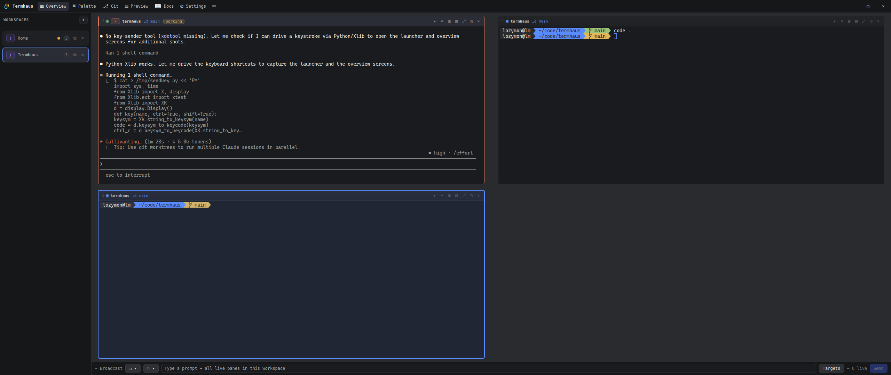
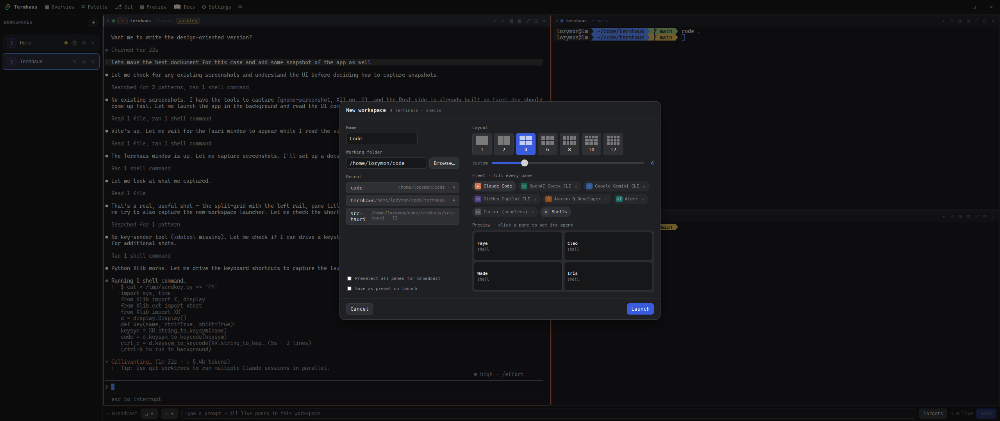
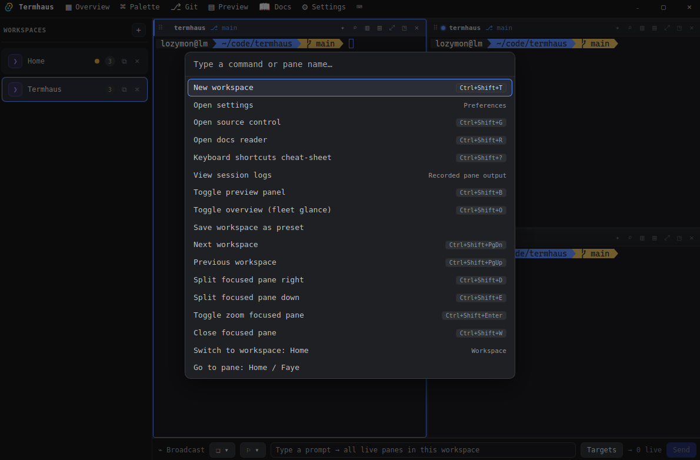
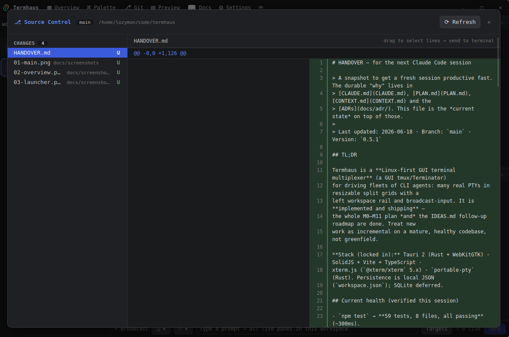
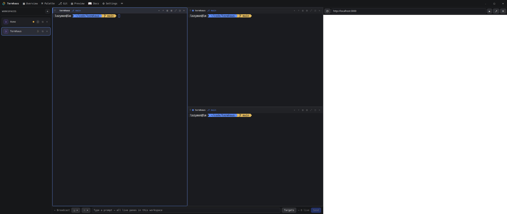
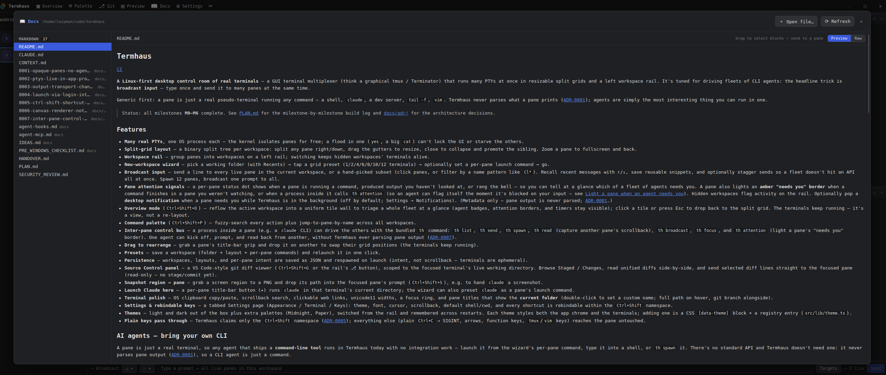
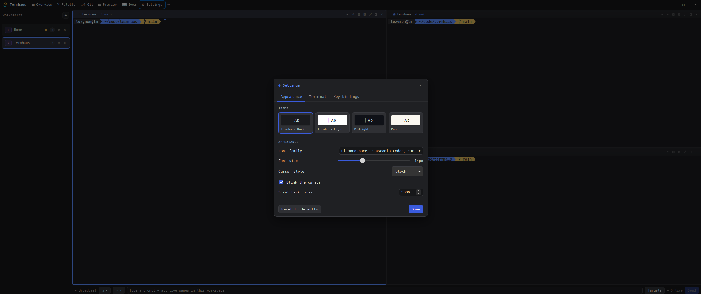
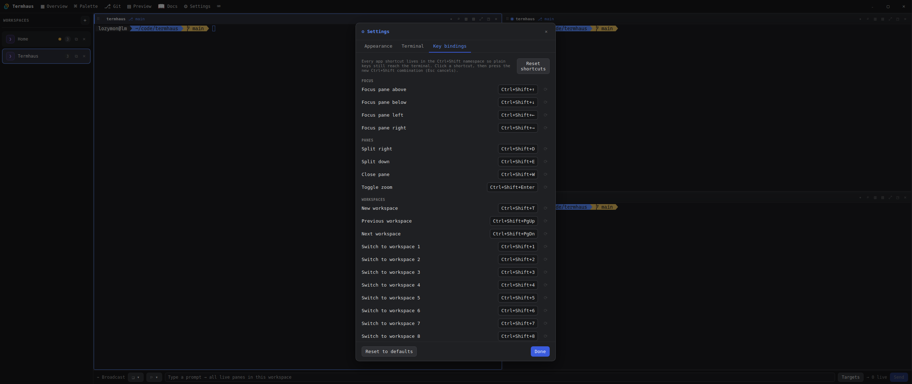

# Loom — Design Handover

> A self-contained brief for a **design session** (e.g. claude.ai/design). It
> describes what Loom is, what it looks like today, the interaction model,
> and the visual system — with annotated screenshots of every key surface.
>
> For engineering internals (PTYs, IPC, the Rust/TS split) see
> [HANDOVER.md](../HANDOVER.md) and [CLAUDE.md](../CLAUDE.md). This doc is the *visual*
> counterpart.
>
> App version `0.5.1` · Linux-first desktop app · Captured 2026-06-18.

---

## 1. What Loom is (in one breath)

A **desktop agent-first developer environment** built on real terminals (a
graphical tmux/Terminator substrate) — for running *many* command-line tools at once,
arranged in **resizable split grids** with a **left rail of workspaces**. It's
tuned for driving fleets of CLI agents, so it has a **broadcast bar** that types
one prompt into many panes at once.

**The single most important design constraint:** a *pane* is **opaque** —
Loom renders the raw bytes of whatever program runs inside it (via a real
terminal emulator, xterm.js) and **never interprets that content**. So design
work is about the **chrome around panes** (rail, title bars, grid gutters,
panels, bars, modals) — *not* the contents of the terminals themselves.

**Vocabulary** (use these exact terms — see [CONTEXT.md](../CONTEXT.md)):
- **Pane** — one tile in the grid, bound 1:1 to a running command. Not "tab", not
  "window", not "terminal" (ambiguous).
- **Pane name** — a short human name (Faye, Cleo, Wade…) auto-assigned from a
  pool, unique per workspace. Shown in the title bar.
- **Workspace** — a named grid of panes, listed in the left rail. Switching
  swaps the whole grid; hidden workspaces keep running.
- **Dead pane** — a pane whose process exited; its tile stays in place (greyed,
  shows exit code) with a restart affordance — it never auto-collapses.
- The hierarchy is exactly two levels: **Workspace → Pane**. There is no
  "window" or "tab" layer.

---

## 2. The main screen

The anatomy, region by region:

- **Top bar** — left: app mark + name. Center/left nav: **Overview · Palette ·
  Git · Preview · Docs · Settings**. Right: standard window controls.
- **Left rail (`WORKSPACES`)** — a vertical list of workspaces. Each row shows a
  name, a **terminal-count badge**, a live activity dot, and inline controls
  (duplicate, close ✕). A **+** at the top opens the new-workspace launcher.
  The active workspace is highlighted with an accent border.
- **The grid** — panes laid out as a **binary split tree**: any pane can split
  horizontally or vertically; drag the **gutters** between panes to re-ratio.
  The focused pane has an accent **focus ring**.
- **Pane title bar** (every pane) — a drag handle, a status dot, the pane name,
  its git branch when relevant, a **working/idle status badge**, and per-pane
  controls (split, zoom, collapse, close).
- **Broadcast bar** (bottom) — a prompt field that sends to **all live panes in
  the workspace** at once, with a **Targets** selector (scope: all / a saved
  group / current) and a **Send** button. This is the headline feature for
  driving many agents together.

---

## 3. Creating work — the new-workspace launcher

Opened by the rail's **+** (or `Ctrl+Shift+T`). It's a **single panel**, two
columns:

- **Left — *where*:** workspace name, the **working folder** (native picker +
  Recents), saved **Presets**, and launch options.
- **Right — *what runs*:** a **layout picker** (mini-grid preview tiles + a 1–16
  slider), a **"fleet" row** that fills every pane with one chosen agent in a
  click, and an **interactive grid preview** where clicking an individual pane
  lets you set *its* agent / command / cwd.

Design intent: go from "a folder" to "N terminals running the right things" in
one screen, with the grid shape always previewed.

---

## 4. The supporting surfaces

These are reachable from the top nav, the command palette, or shortcuts. All of
them are **side panels / overlays that sit beside or over the grid** — the grid
never goes away.

### Command palette (`Ctrl+Shift+P`)

A centered, fuzzy-searchable list of every action *and* every pane ("Go to pane:
Home / Faye"), each row showing its shortcut. The primary keyboard-driven
entry point.

### Source control / Git panel (`Ctrl+Shift+G`)

A two-column diff viewer: changed-files list on the left, unified diff on the
right, with a **Refresh** and a neat touch — *"drag to select lines → send to
terminal"* (a bridge back to the panes).

### Preview panel (`Ctrl+Shift+B`)

A right-side **web preview** (URL bar + reload/pop-out/close) docked next to the
grid — e.g. point it at `localhost:3000` to watch a dev server while terminals
run beside it.

### Docs reader (`Ctrl+Shift+R`)

A rendered-markdown reader with a file list on the left — read project docs
without leaving the app.

---

## 5. The visual system

### Themes & appearance (`Settings → Appearance`)

Four built-in themes, shown as live "Ab" swatch tiles:

| Theme | id | Background | Foreground | Cursor/accent |
|---|---|---|---|---|
| **Loom Dark** (default) | `dark` | `#1a1b1e` | `#e6e6e6` | `#5b8cff` |
| **Loom Light** | `light` | `#ffffff` | `#1c1e22` | `#2f6bff` |
| **Midnight** | `midnight` | `#0f1117` | `#e3e8f0` | `#6ea8fe` |
| **Paper** | `paper` | `#faf7f0` | `#2b2620` | `#5a55d6` |

A theme drives **both** the app chrome (CSS custom properties keyed off
`<html data-theme>`) **and** every terminal's palette, live — switching restyles
open panes instantly. The accent is a **blue/indigo** family across the dark
themes; Paper shifts to a warm cream with an indigo accent.

Appearance also covers: **font family** (defaults to a monospace stack —
Cascadia Code / JetBrains…), **font size** (slider, 14px default), **cursor
style** (block/…), **cursor blink**, and **scrollback lines** (5000 default).

Beyond themes there's a **per-agent tint** concept — panes running a given agent
can carry a subtle color tint to tell a fleet apart at a glance.

### Keyboard model (`Settings → Key bindings`)

Every app shortcut lives in the **`Ctrl+Shift` namespace** by design (so plain
`Ctrl+C` etc. always reach the terminal). Grouped as Focus / Panes / Workspaces.
Notable: directional pane focus (`Ctrl+Shift+↑↓←→`), splits (`+D` right, `+E`
down), zoom (`+Enter`), `Ctrl+Shift+1–9` to jump workspaces. Shortcuts are
rebindable (click → press new combo).

### Type & tone
Monospace-forward, dense-but-calm, dark-default, single cool accent. The UI
should feel like a **professional instrument panel** — quiet chrome that gets
out of the way of the terminals, with the accent reserved for focus/active/live
states.

---

## 6. Design constraints to respect

1. **Don't design pane contents.** Panes render arbitrary terminal output via
   xterm.js; the app never parses it. Design *around* panes.
2. **Two-level hierarchy only** — Workspace → Pane. No tabs, no "windows".
3. **The grid is a binary split tree** — every layout is panes split row/col
   with draggable ratios. Presets are just pre-built trees (1/2/4/6/8/10/12).
4. **`Ctrl+Shift` owns app shortcuts** — keep new shortcuts there.
5. **Linux-first desktop** (Tauri + WebKitGTK), also runs on Windows. It is *not*
   a web app or mobile; design for a resizable desktop window with real window
   chrome.
6. **Panels coexist with the grid** — side panels (Git/Preview/Docs) dock beside
   it; overlays (palette/settings/launcher) float over it. The grid is always
   the substrate.

---

## 7. Where design help is most useful

Good starting points for a design pass (not a mandate — confirm with the owner):

- **Cohesion of the chrome** — title bars, rail, gutters, bars, and panels were
  built incrementally; a unifying visual pass (spacing, weights, iconography,
  state colors) would help.
- **The launcher** — the densest screen; worth a layout/hierarchy critique.
- **Fleet legibility at scale** — when 8–12 panes run the same command, how do
  pane names, tints, status dots, and the broadcast **Targets** scope stay
  scannable?
- **State language** — focused vs. live vs. idle vs. **dead** panes; needs-input
  vs. working. Make these instantly readable across a full grid.
- **Light/Paper themes** — verify the accent and state colors hold up outside
  the dark default.

---

## 8. Reference (engineering, if needed)

- [CONTEXT.md](../CONTEXT.md) — the authoritative glossary.
- [HANDOVER.md](../HANDOVER.md) — engineering state, how to run, architecture rules.
- [CLAUDE.md](../CLAUDE.md) — operating rules & the file map.
- [docs/adr/](../docs/adr/) — design decisions (0001 opacity · 0005 Ctrl+Shift
  namespace · 0006 canvas renderer, etc.).
- Frontend components live in `src/components/` (`WorkspaceRail`, `LayoutNode`,
  `Terminal`, `BroadcastBar`, `NewWorkspaceWizard`, `GitPanel`, `PreviewPanel`,
  `DocsPanel`, `CommandPalette`, `Settings`, `TitleBar`, `ShortcutsOverlay`).
- Screenshots: in this folder (`01`–`08`), captured from the running app.
